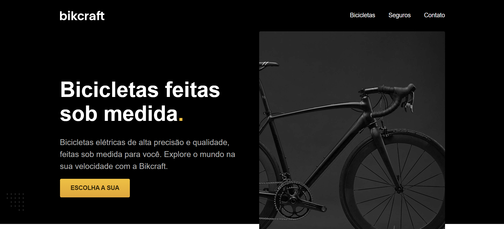

# Origamid

Este repositório contém:

- O projeto **Bikcraft**, desenvolvido durante o curso [HTML e CSS para Iniciantes](https://www.origamid.com) da Origamid. O objetivo é aplicar os fundamentos do desenvolvimento web criando um site responsivo, moderno e sem usar bibliotecas prontas.

- O projeto **FlexBlog**, desenvolvido durante o curso [CSS Flexbox](https://www.origamid.com) da Origamid. O objetivo é aplicar os fundamentos do desenvolvimento web criando um layout responsivo no CSS utilizando apenas as propriedades do Flexbox.

 

---

  
📂 Bikcraft

### Tecnologias

- HTML5, CSS3 (Flexbox e Grid), JavaScript e Git

**Objetivo:** Construir um site responsivo e profissional do zero.

---

### Visual do Projeto

 

---

**Veja ao vivo:** [🔗 Clique aqui para acessar o projeto](https://lisboani.github.io/Origamid/bikecraft/bikcraft.html)

 

  
📂 FlexBlog

### Tecnologias

- HTML5, CSS3 (Flexbox) e Git

**Objetivo:** Construir um site responsivo utilizando flexbox.

---

### Visual do Projeto

 

---

**Veja ao vivo:** [🔗 Clique aqui para acessar o projeto](https://lisboani.github.io/Origamid/flexblog/flexblog.html)

